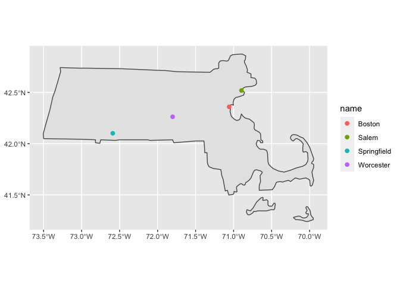

README.Rmd Problem Set \#7
================

## GitHub Documents

This is an R Markdown format used for publishing markdown documents to
GitHub. When you click the **Knit** button all R code chunks are run and
a markdown file (.md) suitable for publishing to GitHub is generated.

## Including Code

You can include R code in the document as follows:

``` r
summary(cars)
```

    ##      speed           dist       
    ##  Min.   : 4.0   Min.   :  2.00  
    ##  1st Qu.:12.0   1st Qu.: 26.00  
    ##  Median :15.0   Median : 36.00  
    ##  Mean   :15.4   Mean   : 42.98  
    ##  3rd Qu.:19.0   3rd Qu.: 56.00  
    ##  Max.   :25.0   Max.   :120.00

## Including Plots

You can also embed plots, for example:

    ## 
    ## Attaching package: 'dplyr'

    ## The following objects are masked from 'package:stats':
    ## 
    ##     filter, lag

    ## The following objects are masked from 'package:base':
    ## 
    ##     intersect, setdiff, setequal, union

    ## ── Attaching packages ─────────────────────────────────────── tidyverse 1.3.1 ──

    ## ✓ ggplot2 3.3.5     ✓ purrr   0.3.4
    ## ✓ tibble  3.1.4     ✓ stringr 1.4.0
    ## ✓ tidyr   1.1.3     ✓ forcats 0.5.1
    ## ✓ readr   2.0.1

    ## ── Conflicts ────────────────────────────────────────── tidyverse_conflicts() ──
    ## x dplyr::filter() masks stats::filter()
    ## x dplyr::lag()    masks stats::lag()

    ## Some larger datasets need to be installed separately, like senators and
    ## house_district_forecast. To install these, we recommend you install the
    ## fivethirtyeightdata package by running:
    ## install.packages('fivethirtyeightdata', repos =
    ## 'https://fivethirtyeightdata.github.io/drat/', type = 'source')

    ## Linking to GEOS 3.8.1, GDAL 3.2.1, PROJ 7.2.1

    ## 
    ## Attaching package: 'maps'

    ## The following object is masked from 'package:purrr':
    ## 
    ##     map

    ## Registered S3 methods overwritten by 'stars':
    ##   method             from
    ##   st_bbox.SpatRaster sf  
    ##   st_crs.SpatRaster  sf

    ## # A tibble: 4 × 3
    ##   name          lat   lon
    ##   <chr>       <dbl> <dbl>
    ## 1 Boston       42.4 -71.1
    ## 2 Salem        42.5 -70.9
    ## 3 Worcester    42.3 -71.8
    ## 4 Springfield  42.1 -72.6

<!-- -->

Note that the `echo = FALSE` parameter was added to the code chunk to
prevent printing of the R code that generated the plot.
